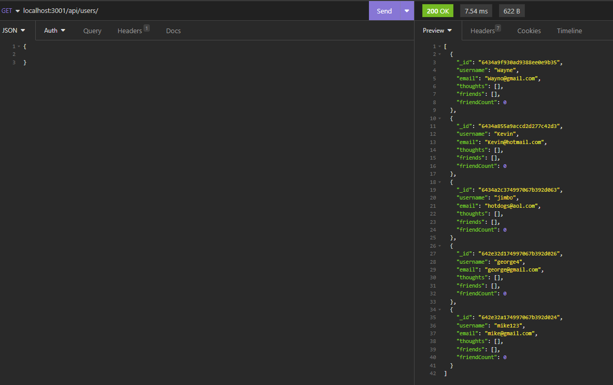
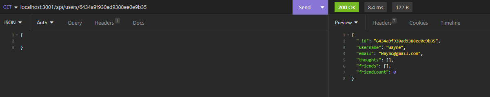

# Unmatched_Social_Network_API

## Table-of-Contents

  * [Description](#description)
  * [Installation](#installation)
  * [Usage](#usage)
  * [License](#license)
  * [Contributing](#contributing)
  * [Links](#questions)
  
## [Description](#table-of-contents)
This is an API for a social networking application. It will allow the user to create an account, connect with friends, share their thoughts, create a friends list and react to a friend's thoughts. 

## [Installation](#table-of-contents)
You can clone the code from the github repository and clone it on your computer. Open the file in VS Code. In the root directory of the project, type in the terminal command line 'npm i' to download the dependencies. Type 'npm start' in the command line and you're ready to go!

## [Usage](#table-of-contents)

  

  
  
## [license](#table-of-contents)
MIT License

## [Contributing](#table-of-contents)
Contributions will not be accepted at this time.

## [Links](#table-of-contents)

[GitHub](https://github.com/mikestem)

[Walk Through Video](https://drive.google.com/file/d/1H5kNTgpK_GCqWObzHQrGLA_NIKABq4CJ/view)

